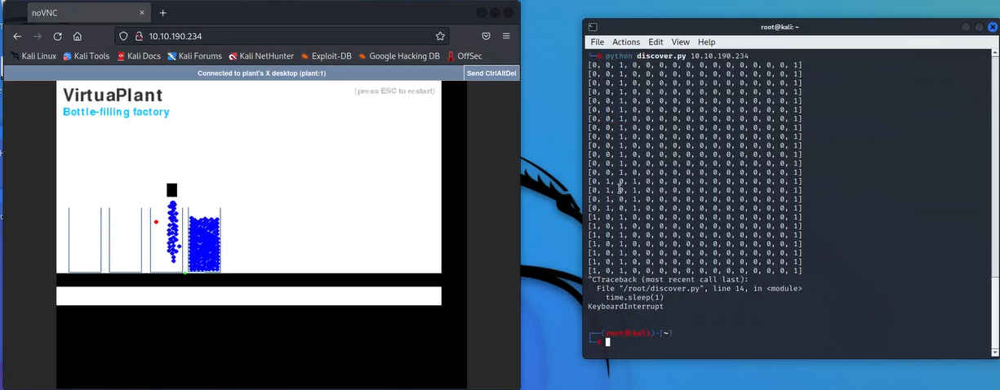

# Attacking ICS Lab #1
Hands-on ICS security labs from TryHackMe, including Attacking ICS #1 and #2. Exploring vulnerabilities in SCADA systems, Modbus protocol, and critical infrastructure security.

## Key Tasks & Concepts
### Task 1: Introduction to OT/ICS

    Learn about Operational Technology (OT) systems like SCADA and PLCs.

    Key takeaway: Security is often secondary to operational continuity in ICS

### Task 2: Modbus Protocol Analysis

    Use Python’s pymodbus library to interact with PLC registers:

        read_holding_registers(): Reads sensor/control values
        

write_register(): Modifies register values (e.g., activating valves)

 

Scripts provided:

    discovery.py (for monitoring registers)

    attack_move_fill.py (for sending malicious commands)

### Task 3: Simulated Plant Interaction

    Observe 16 binary registers (0 or 1) controlling the plant’s behavior (e.g., conveyor belts, fill valves)

Static register (e.g., register 16) identifies non-changing components

### Task 4/5: Attack Simulation

    Manipulate registers to disrupt the production line:

        Overfill bottles by forcing valves to stay open.

        Stop conveyors to cause spills

# Attacking ICS #2
